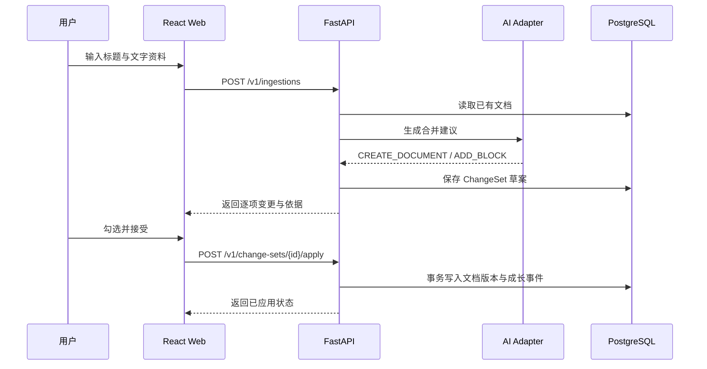

# Nerva 代码架构

## 设计目标

Nerva 的核心不是保存笔记，而是把新输入转换为一组可审阅的知识变更。任何 AI 输出都先成为草案，只有用户接受后才会创建正式文档版本与成长日志。

当前仓库实现了文字输入的最小闭环，正式运行使用 PostgreSQL，并为图片、云端模型、向量检索和跨端应用预留边界。

## 目录结构

```text
Nerva/
├─ apps/
│  ├─ web/                     React + TypeScript 网页端
│  │  ├─ src/
│  │  │  ├─ api.ts             后端 API 客户端
│  │  │  ├─ main.tsx           当前 MVP 页面与状态编排
│  │  │  ├─ styles.css         MVP 视觉样式
│  │  │  └─ types.ts           前端领域类型
│  │  ├─ index.html
│  │  └─ package.json
│  └─ api/                     FastAPI 服务
│     ├─ app/
│     │  ├─ main.py            HTTP 路由和应用入口
│     │  ├─ schemas.py         API 请求/响应契约
│     │  ├─ store.py           SQLAlchemy/PostgreSQL 仓储与事务
│     │  ├─ ai.py              AI 适配器边界与本地演示实现
│     │  ├─ prompts.py         可版本化 Prompt 基线
│     │  └─ settings.py        环境变量配置
│     ├─ tests/                知识闭环测试
│     └─ requirements.txt
├─ docs/
│  └─ ARCHITECTURE.md          本文档
├─ database/
│  ├─ create_database.sql      创建 nerva 数据库
│  └─ schema.sql               PostgreSQL 表、约束与索引
├─ scripts/
│  └─ check-secrets.ps1        提交前密钥扫描
├─ UI/                         原始静态视觉原型，仅作设计参考
├─ .env.example                可提交的环境变量模板
├─ .gitignore                  密钥、数据库与构建产物忽略规则
├─ package.json                仓库级命令
└─ pnpm-workspace.yaml         pnpm 工作区和依赖构建白名单
```

## 当前数据流



## 领域边界

### Ingestion

负责接收来源并启动处理。当前只接受 `text`；图片和 PDF 将扩展为“先上传对象存储，再创建 ingestion”，不会把大文件直接放进 JSON。

### AI Adapter

`LocalDemoAI` 是无密钥、确定性的演示实现。正式百炼适配器应实现相同的 `propose` 契约，并拆成 OCR、知识提取、候选召回、合并规划四步。业务层不能依赖某个模型的专有响应格式。

### ChangeSet

AI 永远生成变更草案而不是直接写正式文档。当前实现：

- `CREATE_DOCUMENT`：创建新的正式文档和版本 1。
- `ADD_BLOCK`：向相关文档追加内容并递增版本。

后续增加 `UPDATE_BLOCK`、`ADD_RELATION`、`REPORT_CONFLICT` 等操作时，应继续通过同一个审批事务执行。

### Knowledge Store

正式运行使用 PostgreSQL，当前按项目约定直接连接本地 `postgres` 管理员账号和独立 `nerva` 数据库；完整 DDL 位于 `database/schema.sql`。SQLAlchemy 隔离数据库驱动与查询实现，自动化测试使用临时 SQLite 文件，不作为应用数据源。下一步加入 pgvector 后，知识切片与向量仍保存在同一个 PostgreSQL 中；对象文件进入 OSS，任务状态与队列进入 Redis/Celery。

### Knowledge Event

每次审批产生不可变成长事件。事件用于回答“新增了什么、合并到哪里、影响几份文档、用户接受了哪些修改”。回滚未来也应创建反向版本和新事件，不删除旧历史。

## API 约定

| 方法 | 路径 | 用途 |
|---|---|---|
| `GET` | `/health` | 服务状态与当前 AI Provider |
| `POST` | `/v1/ingestions` | 创建文字输入和变更草案 |
| `GET` | `/v1/change-sets/{id}` | 获取变更草案 |
| `POST` | `/v1/change-sets/{id}/apply` | 应用选中的变更项 |
| `GET` | `/v1/documents` | 获取正式知识文档 |
| `GET` | `/v1/knowledge-events` | 获取成长日志 |

所有公开 API 使用 `/v1` 前缀。长时间 OCR/模型调用接入后，创建接口返回 `job_id`，前端通过 SSE 接收进度。

## 配置与密钥

- 代码只读取环境变量，不接受前端传入 Provider Key。
- `.env.example` 只包含空值和无敏感性的默认值。
- `.env`、数据库、私钥、证书和签名文件均在 `.gitignore` 中。
- Tauri 更新私钥、Apple 签名证书和云端生产密钥必须进入 CI Secret 或云密钥管理服务。
- 提交前运行 `scripts/check-secrets.ps1`。

## 下一步模块拆分

当前 `main.tsx` 为快速打通闭环而集中编写。下一轮按以下结构拆分：

```text
apps/web/src/
├─ app/             路由、Provider、布局
├─ features/
│  ├─ capture/      上传与输入
│  ├─ changes/      变更审批
│  ├─ documents/    阅读与编辑
│  ├─ growth/       成长日志
│  ├─ search/       混合检索
│  └─ memories/     偏好记忆
├─ components/      通用 UI
└─ lib/             API、格式化、平台能力
```

后端对应增加 `services/`、`repositories/`、`providers/` 和 `workers/`，并通过依赖注入替代模块级单例。
