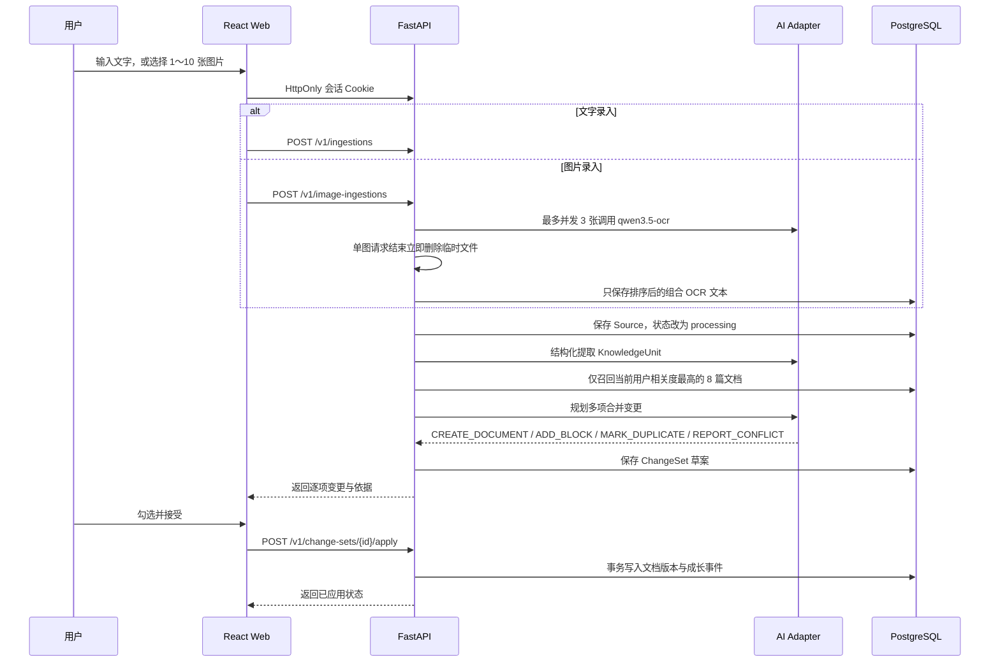

# Nerva 代码架构

## 设计目标

Nerva 的核心不是保存笔记，而是把新输入转换为一组可审阅的知识变更。任何 AI 输出都先成为草案，只有用户接受后才会创建正式文档版本与成长日志。

当前仓库实现了文字与临时图片输入的最小闭环，正式运行使用 PostgreSQL，并为向量检索和跨端应用预留边界。

## 目录结构

```text
Nerva/
├─ apps/
│  ├─ web/                     React + TypeScript 网页端
│  │  ├─ src/
│  │  │  ├─ api.ts             后端 API 客户端
│  │  │  ├─ main.tsx           当前 MVP 页面与状态编排
│  │  │  ├─ styles.css         MVP 视觉样式
│  │  │  └─ types.ts           前端领域类型
│  │  ├─ index.html
│  │  └─ package.json
│  └─ api/                     FastAPI 服务
│     ├─ app/
│     │  ├─ main.py            HTTP 路由和应用入口
│     │  ├─ schemas.py         API 请求/响应契约
│     │  ├─ store.py           SQLAlchemy/PostgreSQL 仓储与事务
│     │  ├─ ai.py              AI 适配器边界与本地演示实现
│     │  ├─ image_ingestion.py 临时图片验证、组合与安全清理
│     │  ├─ prompts.py         可版本化 Prompt 基线
│     │  └─ settings.py        环境变量配置
│     ├─ tests/                知识闭环测试
│     └─ requirements.txt
├─ docs/
│  └─ ARCHITECTURE.md          本文档
├─ database/
│  ├─ create_database.sql      创建 nerva 数据库
│  └─ schema.sql               PostgreSQL 表、约束与索引
├─ scripts/
│  └─ check-secrets.ps1        提交前密钥扫描
├─ UI/                         原始静态视觉原型，仅作设计参考
├─ .env.example                可提交的环境变量模板
├─ .gitignore                  密钥、数据库与构建产物忽略规则
├─ package.json                仓库级命令
└─ pnpm-workspace.yaml         pnpm 工作区和依赖构建白名单
```

## 当前数据流



知识获取使用独立研究链路：React Web 与 Tauri EXE 共用 `/research` 页面，后端通过百炼 Responses API 在 `smart/web/ai` 三种模式下生成可追溯回答。研究阶段不召回个人知识库；只有用户点击“生成入库草案”后，当前回答才转换为 `kind=research` 的 Source 并进入上面的统一审批流程。

## 领域边界

### Identity

用户通过邮箱验证码直接登录，首次验证成功时自动创建账号，不保存密码。服务端把随机会话令牌的 SHA-256 哈希存入 PostgreSQL，浏览器只持有 HttpOnly Cookie。所有知识表都有非空 `user_id`，仓储查询和审批事务始终使用认证上下文限定用户范围，前端不能指定数据所有者。

### Ingestion

负责接收文字或图片来源并启动处理。图片采用 `multipart/form-data`，支持 JPG、PNG、WebP，一批 1～10 张；通过文件签名、Pillow 解码、像素数和哈希校验拒绝伪造格式、损坏、动画及重复图片。图片只保存在系统随机临时目录，不进入项目、数据库或对象存储；每张 OCR 请求结束立即删除，任务结束和应用启动时再兜底清理。数据库只保存组合 OCR 文本和后续分析产物。

图片阶段为 `queued → ocr → extracting → retrieving → planning → complete/failed`。OCR 失败时原图已经删除，要求用户重新上传；OCR 成功后如果知识提取或规划失败，直接使用 `sources.content` 中的 OCR 文本重试。

### AI Adapter

`LocalDemoAI` 用于无密钥开发和 Mock 测试；`BailianAI` 通过百炼 OpenAI-compatible API 依次执行知识提取和变更规划，并使用 Pydantic 严格拒绝额外字段、非法操作和越权目标文档。多输入提取要求每张图片至少有一条可在对应 OCR 中匹配的证据；遗漏时只补提一次，规划也必须覆盖全部知识单元。候选召回按输入独立评分、轮询去重，只读取当前用户的最多 8 篇相关文档。模型失败会把 Source 标记为 `failed`，不静默回退本地算法。

### ChangeSet

AI 永远生成变更草案而不是直接写正式文档。当前实现：

- `CREATE_DOCUMENT`：创建新的正式文档和版本 1。
- `ADD_BLOCK`：向相关文档追加内容并递增版本。
- `MARK_DUPLICATE`：审批后只写成长日志，不修改 Markdown。
- `REPORT_CONFLICT`：审批后只写成长日志，不修改 Markdown。

后续增加 `UPDATE_BLOCK`、`ADD_RELATION`、`REPORT_CONFLICT` 等操作时，应继续通过同一个审批事务执行。

### Knowledge Store

正式运行使用 PostgreSQL，当前按项目约定直接连接本地 `postgres` 管理员账号和独立 `nerva` 数据库；完整 DDL 位于 `database/schema.sql`。SQLAlchemy 隔离数据库驱动与查询实现，自动化测试使用临时 SQLite 文件，不作为应用数据源。下一步加入 pgvector 后，知识切片与向量仍保存在同一个 PostgreSQL 中；当前图片不长期保存，多实例任务状态与队列未来进入 Redis/Celery。

### Knowledge Event

每次审批产生不可变成长事件。事件用于回答“新增了什么、合并到哪里、影响几份文档、用户接受了哪些修改”。回滚未来也应创建反向版本和新事件，不删除旧历史。

人工编辑沿用同一条审计链：保存时在一个事务内更新正式文档、创建完整版本快照、写入 `manual_edit` 变更集与成长事件。客户端必须提交 `base_version`；过期版本以 `DOCUMENT_VERSION_CONFLICT` 拒绝，避免静默覆盖。知识库阅读层渲染正式文档的 Markdown，不维护另一份“人类知识库”副本。

### Export

人类版导出复用正式 Markdown：单篇可按当前或指定历史版本下载，全库仅导出每篇最新版本；PDF 通过登录后的 `/export/print` A4 排版页调用浏览器打印。AI 版使用 `nerva-export-v1` ZIP，包含文档、版本、来源、知识单元、变更链和成长事件 JSONL。

所有导出查询在用户级一致性只读事务中完成，并以字段白名单构建导出包。包内不包含 `user_id`、账号、验证码、会话、数据库连接、内部 `error_message` 或原始图片；图片来源只保留已入库的 OCR 文本与处理元数据。大包先写入系统临时文件，响应流结束后删除；导出本身不产生文档版本或成长事件。

## API 约定

| 方法 | 路径 | 用途 |
|---|---|---|
| `GET` | `/health` | 服务状态与当前 AI Provider |
| `POST` | `/v1/ingestions` | 创建文字输入和变更草案 |
| `POST` | `/v1/image-ingestions` | 上传临时图片并返回异步处理状态 |
| `GET` | `/v1/sources/{id}/processing` | 轮询 OCR 与知识整合进度 |
| `POST` | `/v1/sources/{id}/reprocess` | 使用已保存文字和可选组织建议重新生成未审批草案 |
| `POST` | `/v1/sources/{id}/retry` | 重试当前用户的失败来源 |
| `GET` | `/v1/change-sets/{id}` | 获取变更草案 |
| `POST` | `/v1/change-sets/{id}/apply` | 应用选中的变更项 |
| `GET` | `/v1/documents` | 获取正式知识文档 |
| `GET` | `/v1/documents/{id}` | 获取单篇正式知识文档 |
| `GET` | `/v1/documents/{id}/versions` | 获取文档完整版本历史 |
| `PUT` | `/v1/documents/{id}` | 以乐观并发控制保存人工编辑 |
| `GET` | `/v1/knowledge-events` | 获取成长日志 |
| `POST/GET` | `/v1/research/sessions` | 创建或列出持久化研究会话 |
| `POST` | `/v1/research/sessions/{id}/messages` | 智能、联网或仅 AI 的流式知识获取 |
| `POST` | `/v1/research/messages/{id}/ingestion` | 将单条研究回答幂等转换为入库 Source |
| `GET` | `/v1/exports/markdown` | 导出单篇 Markdown 或全库 Markdown ZIP |
| `GET` | `/v1/exports/knowledge-package` | 导出单篇谱系或全库 AI 结构化 ZIP |

所有业务 API 使用 `/v1` 前缀并要求登录。图片创建接口返回 `source_id`，当前单进程 MVP 每 1.5 秒轮询处理进度；多实例部署时再迁移到持久任务队列与 SSE。

## 配置与密钥

- 代码只读取环境变量，不接受前端传入 Provider Key。
- `.env.example` 只包含空值和无敏感性的默认值。
- `.env`、数据库、私钥、证书和签名文件均在 `.gitignore` 中。
- Tauri 更新私钥、Apple 签名证书和云端生产密钥必须进入 CI Secret 或云密钥管理服务。
- 提交前运行 `scripts/check-secrets.ps1`。

## 下一步模块拆分

当前 `main.tsx` 为快速打通闭环而集中编写。下一轮按以下结构拆分：

```text
apps/web/src/
├─ app/             路由、Provider、布局
├─ features/
│  ├─ capture/      上传与输入
│  ├─ changes/      变更审批
│  ├─ documents/    阅读与编辑
│  ├─ growth/       成长日志
│  ├─ search/       混合检索
│  └─ memories/     偏好记忆
├─ components/      通用 UI
└─ lib/             API、格式化、平台能力
```

后端对应增加 `services/`、`repositories/`、`providers/` 和 `workers/`，并通过依赖注入替代模块级单例。
